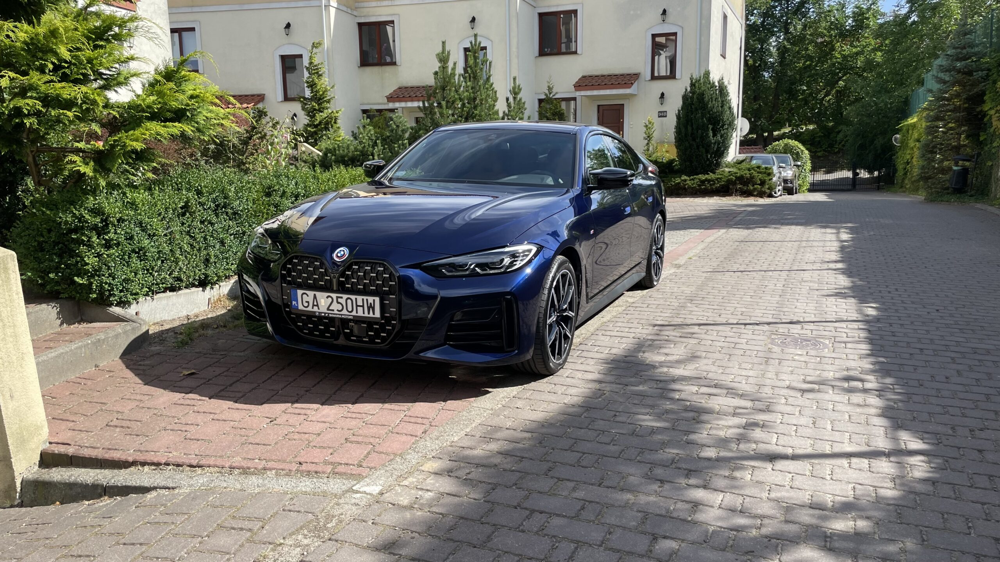

# ML License Plate Vision
## Overview
ML License Plate Vision is a Python-based solution for detecting and reading license plates in images. It utilizes advanced machine learning techniques and OCR (Optical Character Recognition) to accurately identify and extract license plate information from a given image.

## How it works

The whole process consist of three steps:
1. recognizing the license plate in the image
2. cropping the image to the license plate area, enhancing the image in order to be more readable for OCR
3. reading the license plate from the cropped image with the OCR mechanisms

The demo implementation uses two ways of reading license plates:
- Tesseract OCR
- Microsoft/TrOCR

## Installation
To use ML License Plate Vision, you need to have Python installed on your system. Clone the repository and install the required dependencies:

```bash
$ git clone https://github.com/Modevntalking-com/ml-license-plate-vision.git
$ cd ml-license-plate-vision
$ pip install -r requirements.txt
```

## Usage
To detect and read license plates in an image, run the detect.py script with the image URL as an argument:

```bash
$ python ./detect.py -i [IMAGE_URL]
```

For example:

```bash
$ python ./detect.py -i https://modevntalking.pl/wp-content/uploads/2023/11/IMG_5513-scaled.jpeg
```
Example Output
Running the above command will produce the following output:

```plain
detecting license plate from image: https://modevntalking.pl/wp-content/uploads/2023/11/IMG_5513-scaled.jpeg
license plate trocr: GA 250HW
license plate tesseract: GA250HW
```

based on the photo of a car:



Which will be processed - the license plate will be detected, cropped, enhanced and used:


## Summary
The blog post about this project is available at [https://modevntalking.com/2023/11/23/ai-ml-vision-license-plate-recognition/](https://modevntalking.com/2023/11/23/ai-ml-vision-license-plate-recognition//).

You can also check the youtube video

[]([https://www.youtube.com/watch?v=6u9GRzG2wkE](https://www.youtube.com/watch?v=6u9GRzG2wkE)https://www.youtube.com/watch?v=6u9GRzG2wkE)
